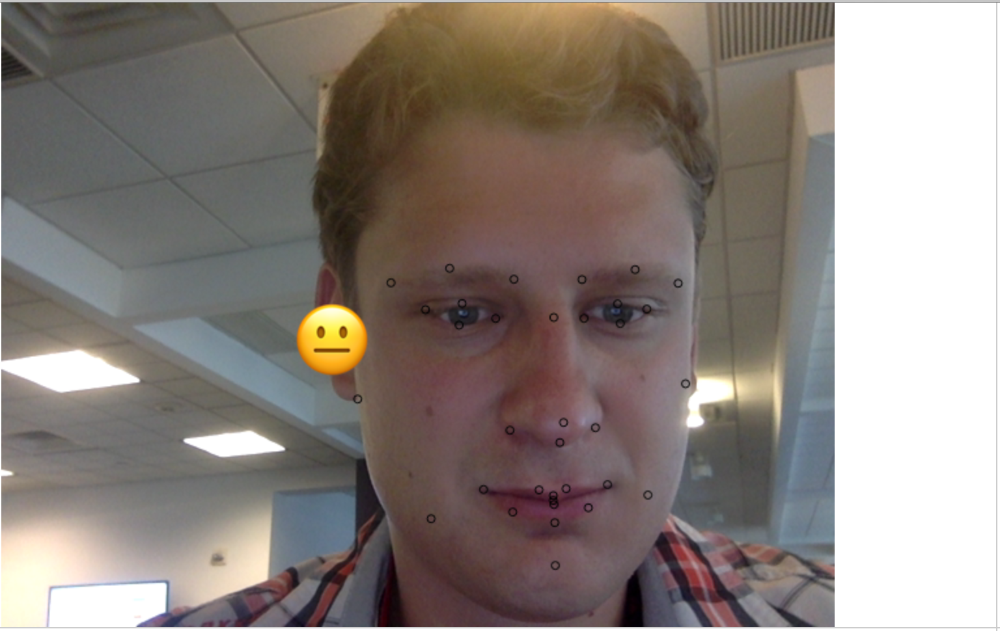
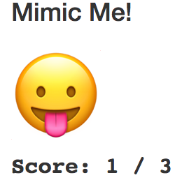

# Mimic Me report

### 1. Display Feature Points
Stroke style has been added and the main implementation for drawing a point:

```javascript
    function drawFeaturePoints(canvas, img, face) {
        ...
        ctx.beginPath();
        ctx.arc(featurePoint.x, featurePoint.y, 2, 0, 2 * Math.PI);
        ctx.stroke();
        ...
    }
```

### 2. Show Dominant Emoji
Selected styles and added printing of emoji to a position, binded to an ear point:

```javascript
    //select emoju coordinates relatively to a face feature point (ear)
    feature_point = face.featurePoints[0];
    face_emoji_x = feature_point.x - 50;
    face_emoji_y = feature_point.y - 20;
    ctx.fillText(face.emojis.dominantEmoji, face_emoji_x, face_emoji_y);
```



### 3. Implement Mimic Me!

First, on start or reset, we initialize the game state with the right amount
and the total amount of emojis equal 0 and non-started epoch:

```javascript
function restart() {
    right_face_total = 0;
    initEpoch();
    setScore(right_face_total, emoji_total);
}

function initEpoch() {
    emoji_total = 0;
    epoch_start = -1;
    initTargetEmoji();
}    
```

Main modifications has been done to _onImageResultsSuccess_ method

First of them - related to a timeout to mimic one emoji:
If we wasn't able to mimic an emoji for a constant _timeout_ seconds - we loose and switch to a next one:

```javascript
    detector.addEventListener("onImageResultsSuccess", function(faces, image, timestamp) {
        //init epoch during first capture of the face
        if (epoch_start == -1) {
            epoch_start = timestamp;
        }

        if (timestamp - epoch_start > timeout) {
            nextEpoch(timestamp);
            setScore(right_face_total, emoji_total);
            return;
        }
      ...
    }

    function nextEpoch(epoch_start_timestamp) {
        emoji_total += 1;
        epoch_start = epoch_start_timestamp;
        initTargetEmoji();
    }

    function initTargetEmoji() {
        target_emoji = randomEmojiCode()
        setTargetEmoji(target_emoji);
    }

    function randomEmojiCode() {
        return emojis[Math.floor(Math.random() * emojis.length)];
    }
```

The second addition related to updating score and playing a sound if we win the current emoji

```javascript
detector.addEventListener("onImageResultsSuccess", function(faces, image, timestamp) {
    ...
    const current_emoji = toUnicode(faces[0].emojis.dominantEmoji);
    if (current_emoji == target_emoji) {
        correctFace();
        playSound();
        nextEpoch(timestamp);
        setScore(right_face_total, emoji_total);
    }

    function correctFace() {
        right_face_total += 1;
    }

    var playSound = (function beep() {
        var snd = new Audio(...);
        return function() {
            snd.play();
        }
    })();
```


